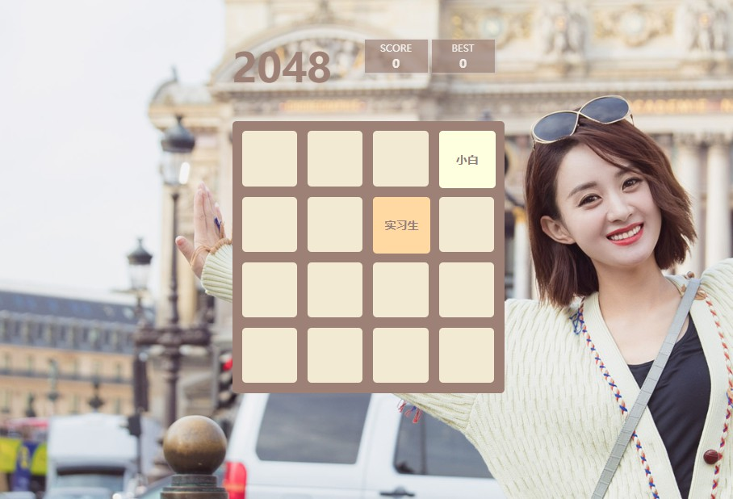
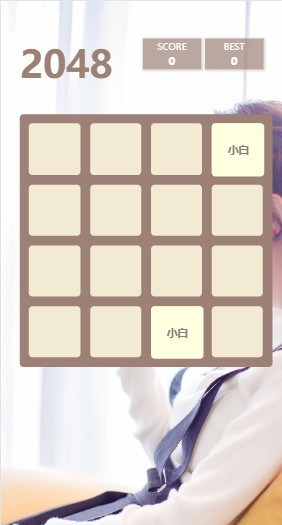

# 2048 Game
## A 2048 game for web page,  Just for fun 

[The preview link](https://wuliguaiguaia.github.io/2048/2048.html)

级别度：
```js
switch (num) {
    case 2:
        text = "小白";
        break;
    case 4:
        text = "实习生";
        break;
    case 8:
        text = "程序媛";
        break;
    case 16:
        text = "项目经理";
        break;
    case 32:
        text = "架构师";
        break;
    case 64:
        text = "技术经理";
        break;
    case 128:
        text = "高经经理";
        break;
    case 256:
        text = "技术总监";
        break;
    case 512:
        text = "总管";
        break;
    case 1024:
        text = "副总裁";
        break;
    case 2048:
        text = "总裁";
        break;
    case 4096: 
        text = "总裁老婆";
        break;
    case 8192:
        text = "总裁岳母";
        break;
    default:
        text = "无法描述";
}
```

## Project ScreenShots

1. PC

    

2. mobile

    

